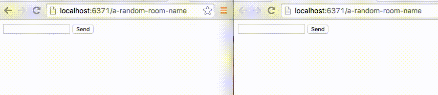

# Philote Chat App

This is an example chat application that uses [Philote](https://github.com/pote/philote) as websockets backend.

## The Ruby Backend

The backend handles incoming http requests, generates a philote [Access Key](https://github.com/pote/philote#access-keys) for each user and renders a view with it's identification token.

This part is done using [Cuba](https://github.com/soveran/cuba) and [Philote-rb](https://github.com/pote/philote-rb) but Philote is not tied to any specific framework or language, any app could implement it similarly even without their own specific client library.

The configuration options:

```ruby
SERVER = ENV.fetch('PHILOTE_URL')
Philote.redis = Redic.new(ENV.fetch('REDIS_URL'))
```

`PHILOTE_URL` is the running Philote instance, `REDIS_URL` is the redis instance with which the Philote server is backed.

Here's the only routing endpoint of note:

```ruby
# Receives HTTP requests to /any-room-name
on ':room' do |room|
  access_key = Philote::AccessKey.create(read: [room], write: [room])

  render 'room', room: room, token: access_key.token, server: SERVER
end
```

## The websockets client

This example uses [Philote-js](https://github.com/13floor/philote-js) but any websocket client would do, see [the implementation](https://github.com/13Floor/philote-js/blob/master/src/philote.js) as a reference.

The relevant example code in this app is here:

```javascript
// Setup the client
var ws = new Philote({url: "<%= server %>"});

var chatbox = document.querySelector("#chat");
var newText = document.querySelector("#new-text")

// We react to incoming messages on the room channel, appending
// their text to the DOM.
ws.on("<%= room %>", function(data, event) {
  chatbox.innerHTML += "<h5>" + event.issuer + "</h5>";
  chatbox.innerHTML += "<p>" + data + "</p>";
});

// Whenever the form is submitted, we publish the text area
// message into the websocket channel.
document.forms["send-text"].onsubmit = function(event) {
  event.preventDefault();
  ws.publish("<%= room %>", newText.value);

  chatbox.innerHTML += "<h5>Me</h5>";
  chatbox.innerHTML += "<p>" + newText.value + "</p>";
  newText.value = "";
}

// Start connection with the access key identifying token
ws.connect("<%= token %>");
```

## Requirements.

You'll need [Redis](http://redis.io) running, and an instance of [Philote](http://github.com/pote/philote) running on the same redis server.

## Run locally

Clone it, configure it, run it.

```bash
$ git clone git@github.com:pote/philote-chat-app.git && cd philote-chat-app
$ source .env.sample # You might want to read the configuration variables and change them before sourcing them.
$ make server        # Will install the required ruby dependencies and run the server.
```

You can then visit your app in the browser, by default at [`localhost:6371/a-random-room-name`](http://localhost:6371/a-random-room-name), open it twice in order to have a fantastic time chatting with yourself for about 20 seconds.

Here's an example:


